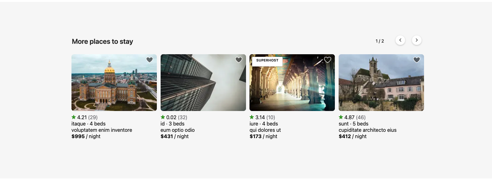

# A Web Application to Reserve Rental Property

## Similar Rental Listing Carousel

Snapshot of Loader.io test:

 <p align="center">
 </p>

### Displays similar rental listings based on...

- Location
- Price
- Number of beds

### Related Projects

- https://github.com/ApexCo/photo_gallery
- https://github.com/ApexCo/reviews
- https://github.com/ApexCo/carousel

Snapshot of component:

 <p align="center">
 </p>

Google Lighthouse:

<p align="center">
</p>

## Table of Contents

1. [Usage](#Usage)
2. [Requirements](#requirements)

## Usage

From within the root directory:

1. npm install: installs packages and dependencies
2. npm run generate: generates the CSVs
3. load schema.sql into postgres using something like: psql -U postgres -f ./database/schema.sql
4. npm run watch: will run webpack bundler and watch files
5. npm start: opens browser and starts the server
6. npm test: runs testing suite

## Requirements

- Node v14.15.4
- PostgreSQL v13.2

^^^^^^^^^^^^^^^^^^^^^^^^^^^^^^^^^^^^^^^^^^^^^^^^^^^^^^^^^^^^^^^^^^^^^^^^^^^^^^^^

# Backend Design

## Endpoints

### Similar listings resource

#### GET /api/similar_listings/:primary_listing_id

Queries similar_listings table by primary listing id. Provides similar listings
based on location, price, and number of beds.

- primary_listing_id param required
- no request body required
- returns similar listings & 200 satus code

```
[
  {
    id: 13,
    image_url: ‘https://image.com’,
    house_type: ‘type’,
    description: ‘description’,
    is_super_host: false,
    average_rating: 4.32,
    number_of_beds: 4,
    number_of_reviews: 2,
    price_per_night: 343
  },
  ...
]
```

### Listings resource

#### POST /api/listings

Adds record to listings table. Allows landlords to post listings to the listings
table.

- no params required
- request body required
- returns a 201 status code

```
{
  image_url: ‘https://image.com’,
  house_type: ‘type’,
  description: ‘description’,
  is_super_host: false,
  average_rating: 4.32,
  number_of_beds: 4,
  number_of_reviews: 2,
  price_per_night: 343
}
```

#### PATCH /api/listings/:listing_id

Update record in listings table. Allows landlords to update listing details in
the listings table.

- id param required
- request body required
- returns a 204 status code

```
{
  image_url: ‘https://image1.com’
}
```

#### DELETE /api/listings/:listing_id

Delete record from listings table. Allows landlords to delete listings from the
listings table.

- id param required
- no request body required
- returns a 204 status code

## Database selection

### PostgreSQL

- This service’s workloads are primarily read resulting in many expensive
  SELECTs that may impact front-end performance.
  - PostgreSQL’s concurrency advantages over MySQL allow the service to maintain
    performance at high traffic volumes on a large dataset.
  - PostgreSQL also provides an easy solution: add a read-only slave server that
    uses asynchronous replication and divide read queries between the servers.
    However, setting up replication takes some care and on-going attention. Our
    team is already maxed out so adding that much complexity does not seem like a
    good idea. However, in the near future, we will likely be scaling and Amazon
    RDS supports asynchronous master-slave replication and it can be launched with
    the click of a button. The time-intensive administration tasks are all handled
    by RDS and our team can spend more time developing features.
- Looking to prioritize consistency and availability across all nodes in a
  distributed system. PostgreSQL delivers consistency and availability that can be
  deployed to multiple nodes using replication.

## Database Schema

### listings table

| key | property name     | data type     |
| --- | ----------------- | ------------- |
| PK  | id                | serial        |
|     | image_url         | character(55) |
|     | house_type        | character(15) |
|     | description       | character(35) |
|     | is_super_host     | boolean       |
|     | average_rating    | decimal       |
|     | number_of_beds    | integer       |
|     | number_of_reviews | integer       |
|     | price_per_night   | integer       |

### similar_listings table

| key | property name      | data type |
| --- | ------------------ | --------- |
| PK  | id                 | serial    |
| FK  | primary_listing_id | integer   |
| FK  | similar_listing_id | integer   |

### users table

| key | property name | data type     |
| --- | ------------- | ------------- |
| PK  | id            | serial        |
|     | user_name     | character(25) |
|     | user_password | character(20) |
|     | email         | character(40) |
|     | first_name    | character(15) |
|     | last_name     | character(15) |

### user_lists table

| key | property name | data type     |
| --- | ------------- | ------------- |
| PK  | id            | serial        |
| FK  | users_id      | integer       |
|     | name          | character(15) |
|     | image_url     | character(55) |

### user_list_listings table

| key | property name | data type |
| --- | ------------- | --------- |
| PK  | id            | serial    |
| FK  | user_lists_id | integer   |
| FK  | listing_id    | integer   |

### Database ER Diagram:

<p align="center">
</p>
