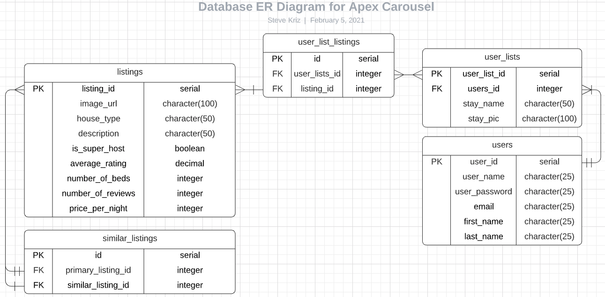
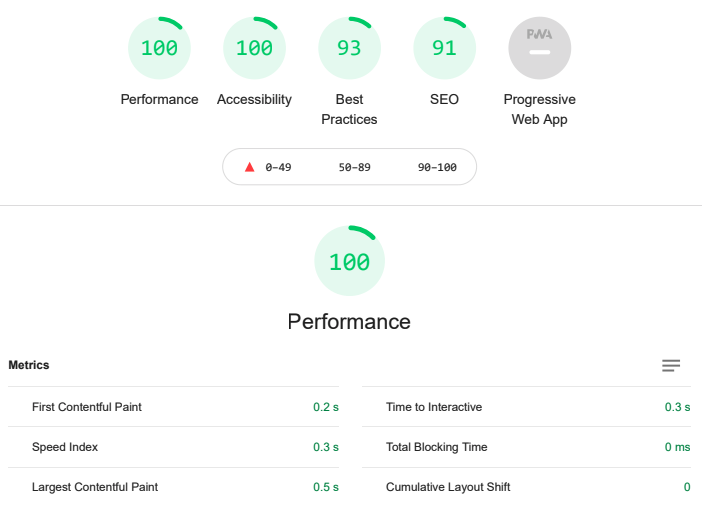
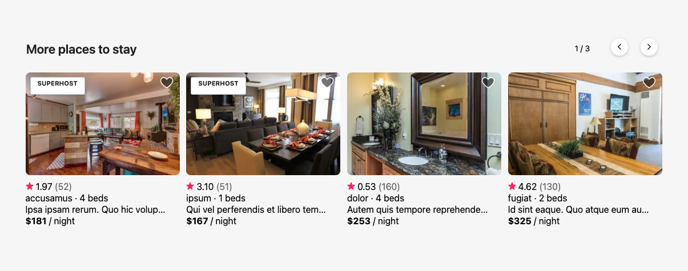

# Application to Browse and Reserve Rental Property

## Similar Rental Listing Carousel

### Displays similar rental listings based on...

  * Location
  * Price
  * Number of beds

# Backend Design

## Endpoints

### Similar listings resource

#### GET /api/similar_listings/:primary_listing_id

Queries similar_listings table by primary listing id. Provides similar listings based on location, price, and number of beds.
  * primary_listing_id param required
  * no request body required
  * returns similar listings & 200 satus code
```
// example request
get('/api/similar_listings/8765');

// example response
[
  {
    listing_id: 13,
    image_url: ‘https://image.com’,
    house_type: ‘type’,
    description: ‘description’,
    is_super_host: false,
    average_rating: 4.32,
    number_of_beds: 4,
    number_of_reviews: 2,
    price_per_night: 343
  },
  ...
]
```

### Listings resource

#### POST /api/listings

Adds record to listings table. Allows landlords to post listings to the listings table.
  * no params required
  * request body required
  * returns a single listing record & 201 status code
```
// example request
post('/api/listings');

// example request body
{
  image_url: ‘https://image.com’,
  house_type: ‘type’,
  description: ‘description’,
  is_super_host: false,
  average_rating: 4.32,
  number_of_beds: 4,
  number_of_reviews: 2,
  price_per_night: 343
}

// example response
{
  listing_id: 13,
  image_url: ‘https://image.com’,
  house_type: ‘type’,
  description: ‘description’,
  is_super_host: false,
  average_rating: 4.32,
  number_of_beds: 4,
  number_of_reviews: 2,
  price_per_night: 343
}
```

#### PATCH /api/listings/:id

Update record in listings table. Allows landlords to update listing details in the listings table.
  * id param required
  * request body required
  * returns a single listing record & 204 status code
```
// example request
patch('/api/listings/13');

// example request body (this example only updates image url)
{
  image_url: ‘https://image1.com’
}

// example response
{
  listing_id: 13,
  image_url: ‘https://image1.com’,
  house_type: ‘type’,
  description: ‘description’,
  is_super_host: false,
  average_rating: 4.32,
  number_of_beds: 4,
  number_of_reviews: 2,
  price_per_night: 343
}
```

#### DELETE /api/listings/:id

Delete record from listings table. Allows landlords to delete listings from the listings table.
* id param required
* no request body required
* returns a 204 status code
```
// example request
delete('/api/listings/13');

// example response
204 deletion successful
```

## Database selection

### PostgreSQL

- This service’s workloads are primarily read resulting in many expensive SELECTs that may impact front-end performance.
  - PostgreSQL’s concurrency advantages over MySQL allow the service to maintain performance at high traffic volumes on a large dataset.
  - PostgreSQL also provides an easy solution: add a read-only slave server that uses asynchronous replication and divide read queries between the servers. However, setting up replication takes some care and on-going attention. Our team is already maxed out so adding that much complexity does not seem like a good idea. However, in the near future, we will likely be scaling and Amazon RDS supports asynchronous master-slave replication and it can be launched with the click of a button. The time-intensive administration tasks are all handled by RDS and our team can spend more time developing features.
- Looking to prioritize consistency and availability across all nodes in a distributed system. PostgreSQL delivers consistency and availability that can be deployed to multiple nodes using replication.

## Database Schema

### similar_listings table

| key | property name      | data type |
| --- | -------------      | --------- |
| PK  | id                 | serial    |
|     | primary_listing_id | integer   |
|     | similar_listing_id | integer   |

### listings table
| key | property name     | data type      |
| --- | -------------     | ---------      |
| PK  | listing_id        | serial         |
|     | image_url         | character(100) |
|     | house_type        | character(50)  |
|     | description       | character(50)  |
|     | is_super_host     | boolean        |
|     | average_rating    | decimal        |
|     | number_of_beds    | integer        |
|     | number_of_reviews | integer        |

### Database ER Diagram:
<p align="center">
</p>
^^^^^^^^^^^^^^^^^^^^^^^^^^^^^^^^^^^^^^^^^^^^^^^^^^^^^^^^

# Frontend Design
## Related Projects

  - https://github.com/The-Casuals/photo_gallery
  - https://github.com/The-Casuals/casual-checkout-service
  - https://github.com/The-Casuals/reviews
  - https://github.com/The-Casuals/photo_carousel


Page Speed:
<p align="center">
</p>

Snapshot of component:
 <p align="center">
 </p>


## Table of Contents

  1. [Usage](#Usage)
  2. [Requirements](#requirements)

## Usage
From within the root directory:

  1. npm install: installs packages and dependencies necessary
  2. npm start: starts the server
  3. npm run getData: seeds the database
  4. npm run watch: will run webpack bundler and watch files
  5. npm test: runs testing suite

## Requirements
  - Node v14.15.4
  - MongoDB v4.4.3
